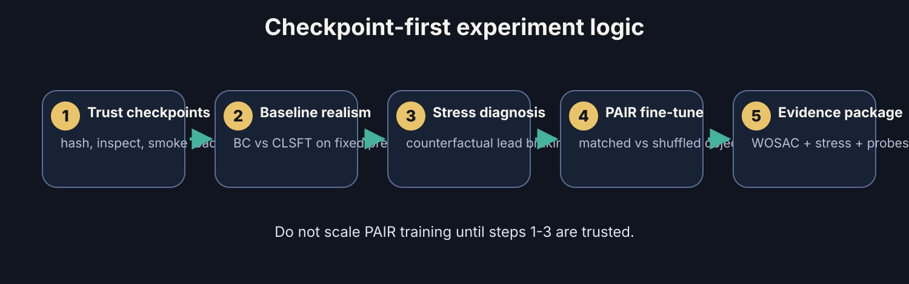
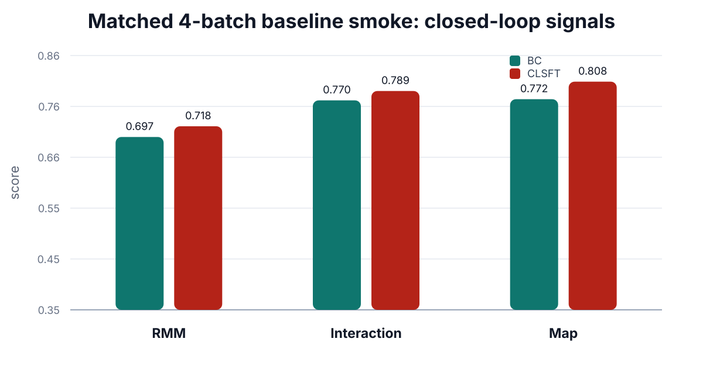
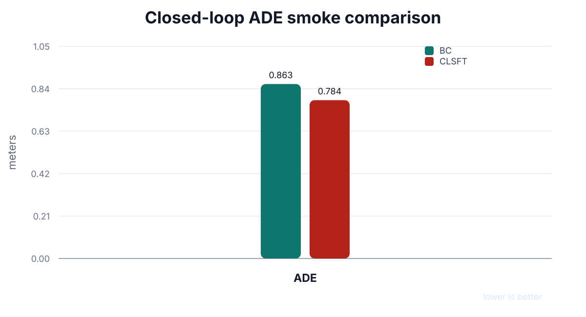
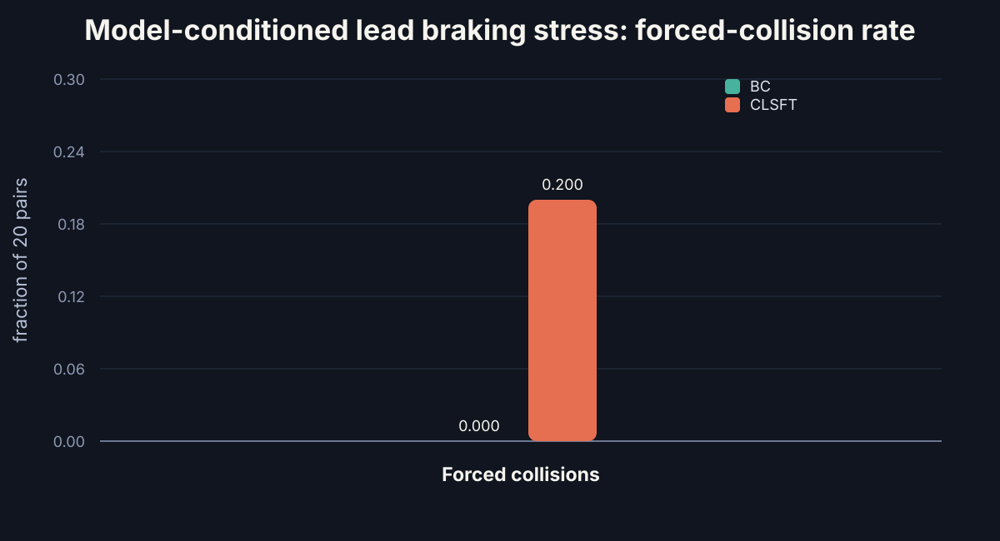
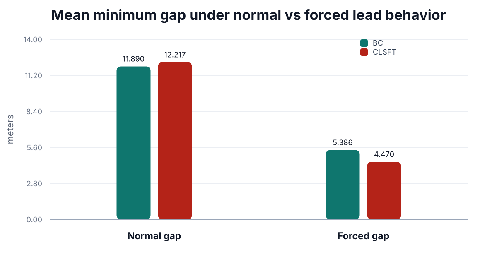

## SMART-PAIR {.title-slide}

:::: {.title-card}
::: {.r-stack}

Research deck | traffic simulation | WOSAC-style evaluation

<h1>SMART-PAIR</h1>

A checkpoint-first plan for improving SMART-style multi-agent traffic simulation with a training-time predictive interaction regularizer and counterfactual stress diagnosis.

SMART baseline
CAT-K reference
PAIR fine-tuning
Counterfactual stress tests

:::

::: {.hero-panel}
<h3>Core idea</h3>

$$
\mathcal{L}_{\text{SMART-PAIR}}
=
\mathcal{L}_{\text{task}}
+
\lambda_{\text{PAIR}}\mathcal{L}_{\text{PAIR}}
$$

Keep the deployed SMART generator unchanged. Add a training-only objective that forces hidden states to predict future multi-agent interaction structure.

<strong>Inference footprint:</strong> unchanged SMART rollout path. PAIR is a fine-tuning regularizer, not a bigger deployed simulator.

:::
::::

## Why This Project Exists

:::: {.grid-3}
::: {.claim-card}
<h3>1&#46; SMART is strong</h3>

SMART treats driving as next-token prediction over learned motion tokens and map context.

This gives an elegant language-like formulation for multi-agent rollout.

:::

::: {.claim-card}
<h3>2&#46; CAT-K is useful</h3>

CAT-K improves closed-loop behavior by selecting model-likely tokens closer to logged futures.

It is a strong fine-tuning reference, not a strawman.

:::

::: {.claim-card}
<h3>3&#46; A gap remains</h3>

Logged-future realism may not fully test whether agents react correctly when another agent changes behavior.

This is the opening for counterfactual interaction robustness.

:::
::::

<strong>Research claim boundary:</strong> we are not claiming CAT-K is weak. We are asking whether logged-future metrics under-test changed-interaction response quality.

## First-Principles Distinction

:::: {.grid-2}
::: {.card}
<h3>Standard realism</h3>

$$
\hat{\tau}_{1:N} \sim p_{\theta}(\tau_{1:N}\mid H,M)
$$

Can the simulator sample joint futures that look like the dataset?

:::

::: {.card}
<h3>Counterfactual interaction realism</h3>

$$
\hat{\tau}_{-j}^{cf}
\sim
p_{\theta}(\tau_{-j}\mid H,M,\operatorname{do}(\tau_j=\tilde{\tau}_j))
$$

If one agent behaves differently, do the nearby agents react plausibly?

:::
::::

$$
\text{closeness to logged future}\;\neq\;\text{correct response under changed interaction}
$$

## The Baseline Architecture We Keep

:::: {.grid-2}
::: {.card}
<h3>SMART generator path</h3>

- Vectorized map tokens enter **RoadNet**.
- Agent motion tokens enter **MotionNet**.
- Temporal, interaction, and map-agent attention produce next-token distributions.
- Rollout samples or selects the next motion token autoregressively.
:::

::: {.card}

:::
::::

## SMART-PAIR: Small Training-Time Addition

:::: {.grid-2}
::: {.card}

:::

::: {.card}
<h3>What changes?</h3>

- Use existing hidden states from the SMART agent decoder.
- Predict future interaction latents through a compact PAIR branch.
- Train with matched future targets and a shuffled-target control.
- Remove the PAIR branch at inference.

$$
\mathcal{L}_{\text{PAIR}}
= 2 - 2\cos\left(\hat{z}_{i,r},\operatorname{sg}(z^+_{i,r})\right)
$$

:::
::::

## Experiment Logic: Checkpoint First

The project should not scale new training until checkpoint trust and stress diagnosis are reproducible.

## Current Substrate Status

:::: {.grid-4}
::: {.metric-card}

Author checkpoints

2

BC and closed-loop fine-tuned reference checkpoints are available locally.

:::

::: {.metric-card}

Smoke cache

✓

Small fixed cache is enough for load, rollout, and validation-prefix checks.

:::

::: {.metric-card}

Stress pairs

20

Diverse lead-braking pairs across 10 scenarios for first diagnosis.

:::

::: {.metric-card}

PAIR scaffold

off

Implemented behind disabled-by-default config flags.

:::
::::

## Baseline Smoke Results

:::: {.grid-2}
::: {.card}

:::

::: {.card}

:::
::::

Scope: 4 validation batches, batch size 2, one closed-loop rollout, same fixed prefix. This is a mechanics/trust table, not a paper-grade benchmark.

## Baseline Table

| Model | Open acc | Open loss | Closed ADE ↓ | RMM ↑ | Interaction ↑ | Map ↑ | Scenarios |
|---|---:|---:|---:|---:|---:|---:|---:|
| BC | 0.8198 | 2.3412 | 0.8633 | 0.6966 | 0.7701 | 0.7724 | 8 |
| CLSFT | 0.8163 | 2.9705 | 0.7836 | 0.7182 | 0.7889 | 0.8076 | 8 |

<strong>Interpretation:</strong> the closed-loop fine-tuned checkpoint improves closed-loop ADE, RMM, interaction, and map metrics on this small fixed prefix. This makes it a credible reference before testing PAIR.

## Counterfactual Stress Diagnosis

:::: {.grid-2}
::: {.card}
<h3>Lead-braking intervention</h3>

A lead vehicle is forced to follow a plausible braking token sequence. The model must generate the follower response.

$$
\tilde{\tau}_{lead} = \operatorname{Brake}(\tau_{lead}^{*}),
\qquad
\hat{\tau}_{follower}^{cf} \sim p_{\theta}(\cdot \mid \operatorname{do}(\tilde{\tau}_{lead}))
$$

:::

::: {.card}
<h3>Metrics</h3>

- forced collision rate
- normal vs forced minimum gap
- minimum time-to-collision
- follower speed delta at 3 seconds
- paired videos for qualitative inspection
:::
::::

## Focal Rollout Comparison: Lead-Braking Case

<h3>Ground truth</h3>

Logged scenario reference for case <code>17a010edfe6d47b3</code>, follower 15, lead 22.

<h3>SMART-BC rollout</h3>

visual collision evidentselected-pair gap 5.21 mselected-pair TTC 2.62 s

Behavior-cloned SMART-tiny checkpoint. The pair metric does not capture every visible rollout collision, so this panel is treated as qualitative evidence.

<h3>SMART-CLSFT rollout</h3>

visual collision evidentselected-pair gap 0.19 mselected-pair TTC 0.017 s

Closed-loop fine-tuned reference checkpoint. The selected-pair metric and visual rollout both indicate a severe interaction failure.

GIFs are shown side-by-side for rapid visual comparison. Pair metrics are not global collision metrics; use this slide as qualitative diagnosis, not a benchmark claim.

## First Stress Signal

:::: {.grid-2}
::: {.card}

:::

::: {.card}

:::
::::

Scope: 20 selected lead/follower pairs from 10 scenarios. This is diagnostic evidence only; visual inspection and larger coverage are still required.

## What The Stress Result Means

:::: {.grid-2}
::: {.card}
<h3>Useful signal</h3>

On the 20-pair diagnostic subset, the fine-tuned checkpoint shows more forced lead-braking collisions than the BC checkpoint despite similar normal-condition gaps.

This suggests the stress harness may reveal behavior not captured by the small aggregate realism prefix.
:::

::: {.card}
<h3>Not yet a claim</h3>

The subset is small. The intervention family is narrow. No videos were generated in this pass. The result must be replicated with stronger controls before being treated as evidence.

<strong>Decision gate:</strong> do not claim PAIR helps until matched PAIR, shuffled PAIR, BC, and CLSFT are compared on the same frozen stress suite.

:::
::::

## PAIR Fine-Tuning Design

:::: {.grid-2}
::: {.card}
<h3>Matched PAIR</h3>

$$
\theta_{PAIR}
=
\operatorname{FT}\left(
\theta_{BC},
\mathcal{L}_{task}+\lambda\mathcal{L}_{PAIR}
\right)
$$

Target latents come from the true future token structure.
:::

::: {.card}
<h3>Shuffled control</h3>

$$
\theta_{shuffle}
=
\operatorname{FT}\left(
\theta_{BC},
\mathcal{L}_{task}+\lambda\mathcal{L}_{PAIR}^{shuffle}
\right)
$$

Same capacity and training path, but future targets are mismatched.
:::
::::

If matched PAIR improves stress behavior while shuffled PAIR does not, the evidence points toward future-interaction structure rather than extra parameters or extra optimization steps.

## Minimal Experiment Matrix

| Variant | Initialization | Extra objective | Purpose |
|---|---|---|---|
| BC | author BC checkpoint | none | behavior-cloning baseline |
| CLSFT / CAT-K reference | author fine-tuned checkpoint | closed-loop fine-tuning | strong reference |
| SMART-PAIR | author BC checkpoint | matched PAIR | proposed method |
| Shuffled PAIR | author BC checkpoint | shuffled PAIR | negative control |

Every variant must be evaluated on the same validation subset, same stress manifest, same rollout settings, and same random seeds.

## Evidence Package Required

:::: {.grid-3}
::: {.card}
<h3>Standard realism</h3>

- RMM
- interaction metrics
- map metrics
- kinematic metrics
- closed-loop ADE
:::

::: {.card}
<h3>Counterfactual diagnosis</h3>

- forced collision rate
- min gap distribution
- TTC distribution
- speed-response curves
- side-by-side videos
:::

::: {.card}
<h3>Representation evidence</h3>

- hidden-state future probes
- matched vs shuffled ablation
- PAIR cosine curves
- no-inference-size increase proof
:::
::::

## Engineering Invariants

<strong>Invariant 1:</strong> with <code>pair.enabled=false</code>, author checkpoints must strict-load with zero missing or unexpected keys.

<strong>Invariant 2:</strong> PAIR must be training-only unless an explicit inference-time reranking experiment is introduced.

<strong>Invariant 3:</strong> no restricted checkpoints, processed WOMD files, or private raw logs enter public slides or GitHub history.

## Current Limitations

:::: {.grid-2}
::: {.card}
<h3>Scientific limitations</h3>

- Stress suite currently covers one intervention family.
- 20-pair diagnosis is too small for a claim.
- Need visual inspection to rule out metric artifacts.
- Need non-interference controls and shuffled PAIR comparison.
:::

::: {.card}
<h3>Engineering limitations</h3>

- PAIR scaffold exists but has not been scaled.
- Stress evaluator needs faster scenario caching and video export.
- Validation must expand beyond the smoke prefix.
- Documentation still needs cleanup of old J-SMART names.
:::
::::

## Near-Term Plan

<strong>1. Freeze deck inputs</strong>public-safe notes, plots, diagrams

<strong>2. Review code changes</strong>PAIR and stress harness regression checks

<strong>3. Generate videos</strong>BC vs CLSFT stress cases

<strong>4. Run PAIR smoke</strong>matched and shuffled fine-tune

<strong>5. Expand evidence</strong>fixed stress suite plus WOSAC-style metrics

## Takeaway

:::: {.grid-2}
::: {.card}
<h3>Technical thesis</h3>

SMART-PAIR is a conservative modification: keep SMART's deployed autoregressive generator, but regularize the training representation toward future interaction structure.
:::

::: {.card}
<h3>Scientific thesis</h3>

A simulator should be judged not only by logged-future realism, but also by whether it reacts plausibly when another agent's future changes.
:::
::::

$$
\text{standard realism} + \text{counterfactual reaction quality} + \text{representation evidence}
$$

## Backup: Source Grounding

- SMART: next-token multi-agent motion generation.
- CAT-K: closed-loop fine-tuning reference through top-$K$ token targets.
- WOSAC: realism metrics covering kinematic, interaction, and map behavior.
- JEPA-style learning: latent predictive objectives that organize hidden states around future structure.

This deck is public-safe: it includes only derived metrics, diagrams, equations, and research planning. It excludes checkpoints and restricted dataset artifacts.

