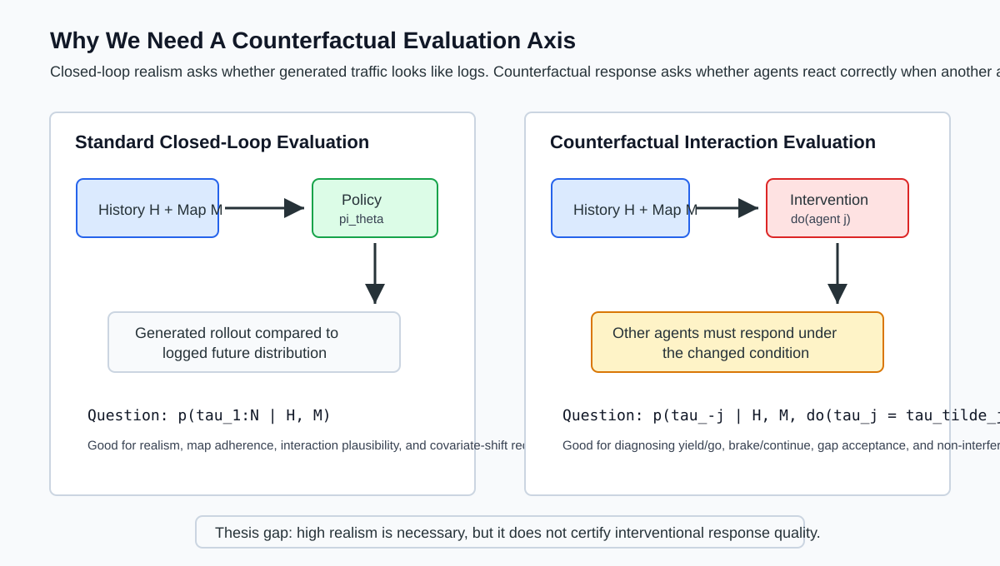
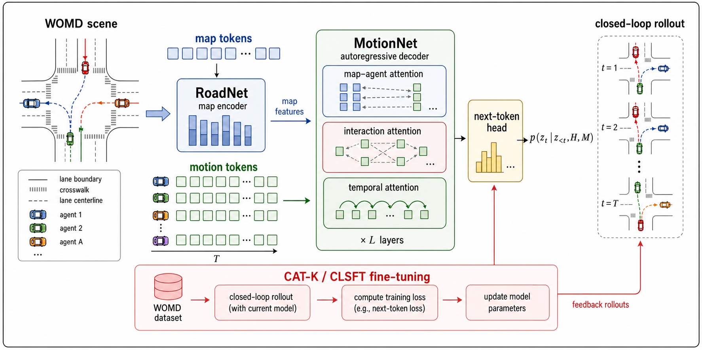
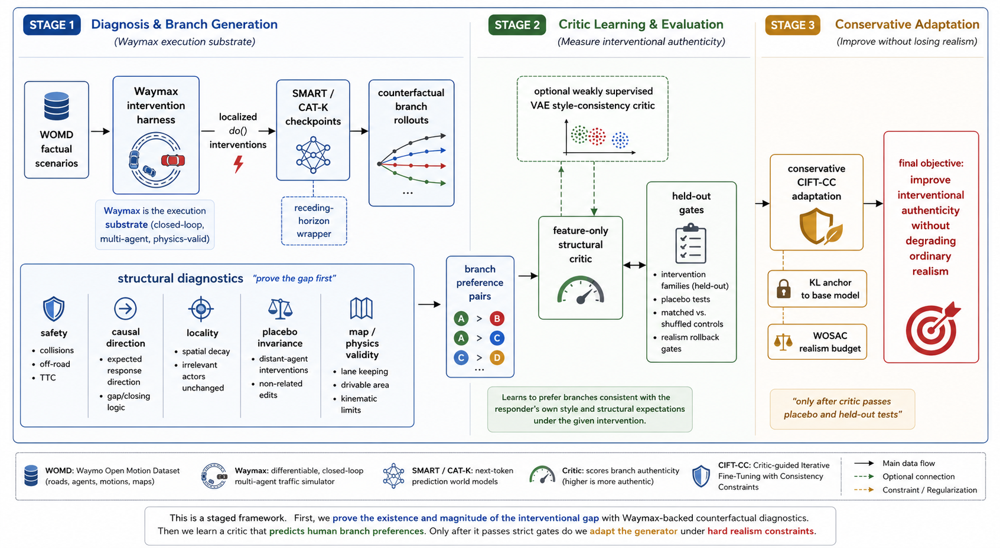
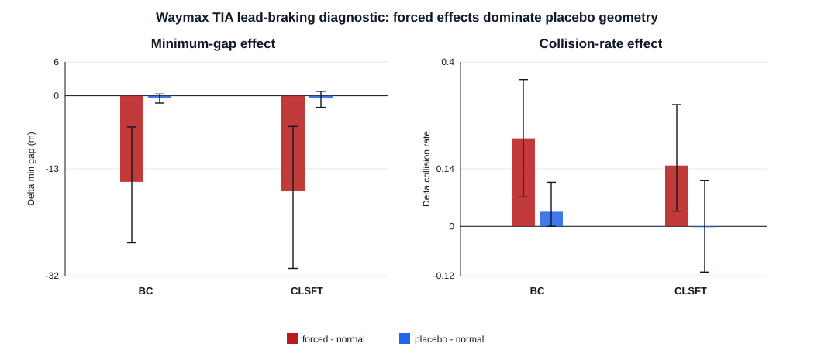
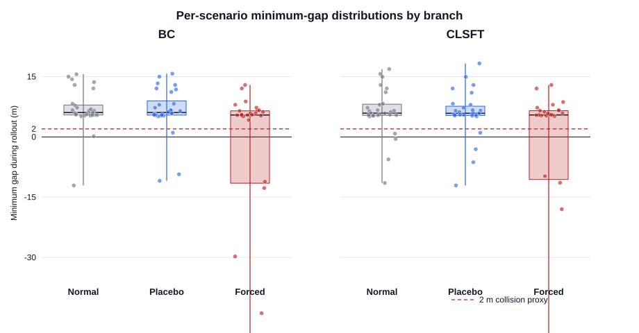
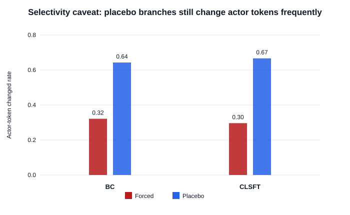
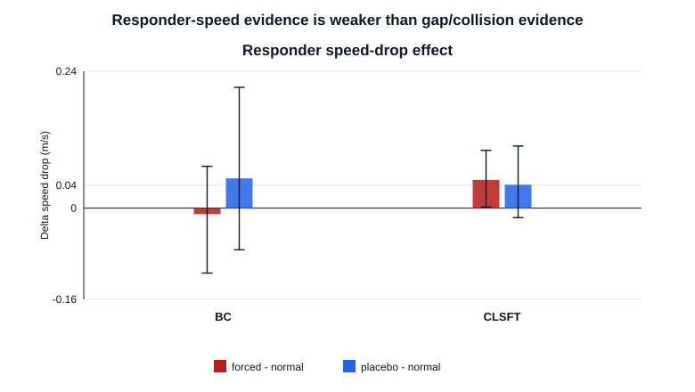
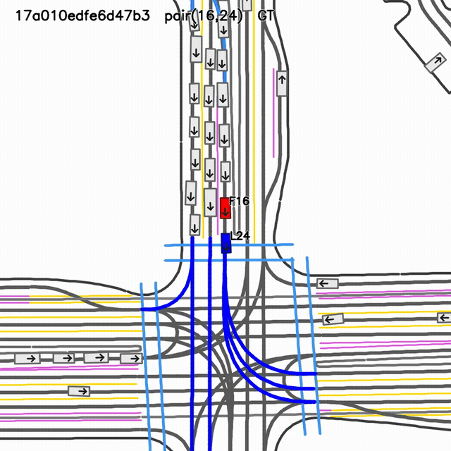
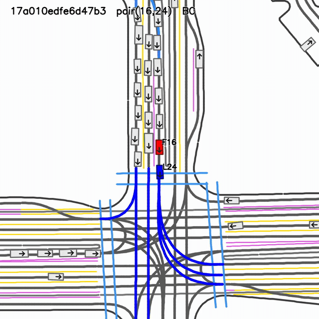
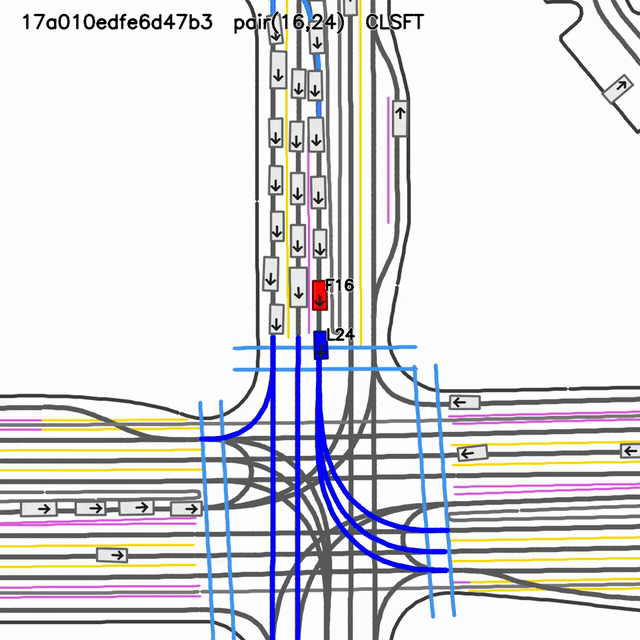

---
format:
  revealjs:
    title-slide-attributes:
      data-background-color: "#ffffff"
---

## Counterfactual Evaluation and Adaptation of Learned Multi-Agent Traffic Simulators {#title-slide .title-slide}

:::: {.title-card}
::: {}

Tentative thesis deck | SMART / CAT-K | WOMD / WOSAC / Waymax

<h1>Traffic Interaction Authenticity</h1>

A diagnostic-first research direction for learned multi-agent traffic simulators: preserve ordinary WOSAC-style realism, but additionally test whether generated agents respond plausibly when one actor is externally changed.

SMART-BC
SMART-CLSFT / CAT-K-style
Waymax branch harness
Counterfactual diagnostics

M.Tech Smart Mobility, IIT Hyderabad

:::

::: {.hero-panel}
<h3>Central claim</h3>

A simulator can look realistic under ordinary closed-loop evaluation and still respond poorly to localized interventions.

$$
p_\theta(\tau_{1:N}\mid H,M)
\quad \text{and} \quad
p_\theta(\tau_{-j}\mid H,M,\operatorname{do}(\tau_j=\tilde{\tau}_j))
$$

These are different evaluation objects. The second one is the object needed for "what happens if" simulation.

<strong>Current method stance:</strong> diagnose first, validate the execution substrate, learn a small audited critic only if the branch signal is stable, and adapt the simulator only under realism-preservation budgets.

:::
::::

## Story in One Slide

:::: {.grid-3}
::: {.claim-card}
<h3>Problem</h3>

WOSAC-style realism asks whether generated traffic looks plausible under logged initial conditions.
:::

::: {.claim-card}
<h3>Gap</h3>

It does not directly ask whether nearby agents respond plausibly after a localized `do()` intervention.
:::

::: {.claim-card}
<h3>Evidence</h3>

BC and CLSFT/CAT-K-style checkpoints can disagree between ordinary validation and counterfactual stress tests.
:::
::::

:::: {.grid-3}
::: {.claim-card}
<h3>Substrate</h3>

Waymax gives a reproducible closed-loop branch environment for normal, forced, and placebo rollouts.
:::

::: {.claim-card}
<h3>Method</h3>

Define Traffic Interaction Authenticity, validate structural critics, then consider conservative CIFT-CC adaptation.
:::

::: {.claim-card}
<h3>Ask</h3>

Feedback on the problem formulation, evidence gates, and whether the next engineering phase is defensible.
:::
::::

## Why This Matters

:::: {.split-figure}
::: {}
{.full-figure}
:::

::: {}

Simulation is useful when it answers interventions

Ordinary learned simulators are usually trained and evaluated on the logged distribution:

$$
\hat{\tau}_{1:N} \sim p_\theta(\tau_{1:N}\mid H,M).
$$

The counterfactual question changes the conditioning:

$$
\hat{\tau}_{-j} \sim p_\theta(\tau_{-j}\mid H,M,\operatorname{do}(\tau_j=\tilde{\tau}_j)).
$$

The logged future is no longer a ground-truth oracle for the other agents after the intervention.
:::
::::

## Dataset and Benchmark Context

:::: {.grid-3}
::: {.claim-card}
<h3>WOMD</h3>

Logged multi-agent driving scenarios with agent state histories, future trajectories, map polylines, and traffic signals.

It is observational: it records what happened, not what would have happened under a modified actor future.

:::

::: {.claim-card}
<h3>WOSAC</h3>

The sim-agent task asks models to generate realistic future rollouts for up to 32 modeled agents from logged scenario context.

It is a world-model-style task over multi-agent future traffic distributions.

:::

::: {.claim-card}
<h3>Our axis</h3>

Traffic Interaction Authenticity asks whether realism is preserved after localized interventions.

This complements WOSAC; it does not replace it.

:::
::::

## WOSAC as a Stochastic World-Model Task

:::: {.grid-2}
::: {}
The WOSAC view can be written as a stochastic closed-loop rollout problem:

$$
s=(H,M,\tau_{1:N}),
$$

$$
\hat{\tau}_{1:N}\sim p_\theta(\tau_{1:N}\mid H,M).
$$

The hidden Markov view is useful: a simulator samples future traffic states from a learned transition model conditioned on history and map context.
:::

::: {.callout .blue}
<strong>Why this is not enough:</strong> matching plausible future rollouts does not identify the response operator under interventions. Two simulators can produce similar observational rollouts while encoding different causal response rules.
:::
::::

## Related Work: Where This Sits

| Line of work | What it gives | Remaining gap for this project |
|---|---|---|
| WOSAC and sim agents | Standardized closed-loop realism benchmark | Does not directly score localized interventional response |
| SMART and MotionLM-like NTP models | Scalable tokenized autoregressive traffic generation | Next-token likelihood is observational continuation |
| CAT-K / CLSFT | Closed-loop post-training improves rollout realism | Logged future anchoring remains ambiguous after intervention |
| Controllable / causal simulation | Perturbation and safety-critical scenario ideas | Not yet a unified authenticity protocol for SMART/CAT-K-style rollouts |
| Driving style / latent personality | Models behavior diversity and agent-specific tendencies | Needs integration with branch-level intervention diagnostics |

::: {.callout .blue}
<strong>Research gap:</strong> existing work gives <strong>realistic closed-loop simulation</strong>, <strong>tokenized autoregressive generation</strong>, <strong>closed-loop fine-tuning</strong>, <strong>controllable stress generation</strong>, and <strong>latent driver-style modeling</strong>. What remains missing is a unified protocol for <strong>localized interventional response authenticity</strong>.
:::

## SMART / CAT-K Substrate

{.full-figure}

<strong>SMART/CAT-K next-token simulation pipeline.</strong> SMART-style models tokenize road vectors and agent motion, encode map context with RoadNet, and autoregressively decode future motion tokens with MotionNet. CAT-K/CLSFT-style post-training improves closed-loop behavior by fine-tuning the generator under rollout-aware feedback.

## Why Next-Token Prediction Is Still the Right Baseline

:::: {.grid-2}
::: {}
SMART-style next-token generation is not a strawman. It gives:

- scalable multi-agent rollout;
- map-conditioned sampling;
- reusable token vocabulary;
- a strong WOSAC-oriented baseline;
- author-provided BC and CLSFT checkpoints for controlled comparison.
:::

::: {}
But the base objective is observational:

$$
p_\theta(z_{1:T}\mid H,M)
=
\prod_{t=1}^{T} p_\theta(z_t\mid z_{<t},H,M),
$$

$$
\mathcal{L}_{\mathrm{NTP}}
=
-\sum_{t=1}^{T}\log p_\theta(z_t\mid z_{<t},H,M).
$$

It does not by itself identify what the response should be after `do()` changes one actor.
:::
::::

## Problem Formulation

An intervention case is defined as

$$
m = (j,\ell,\tilde{\tau}_j^m,\Omega_m),
$$

where `j` is the forced actor, `ell` is the intervention family, `tilde tau` is the imposed branch, and `Omega_m` is the responder set.

Valid branches must satisfy map, kinematic, and causal-relevance gates:

$$
\mathcal{M}_{\mathrm{valid}}
=
\{m:V_{\mathrm{map}}(m)=1,\ V_{\mathrm{kin}}(m)=1,\ E_{\mathrm{force}}(m)\leq \epsilon_f,\ \Omega_m\neq \emptyset\}.
$$

The target is not exact counterfactual truth. The target is an operational authenticity score that is falsifiable under controls.

## Traffic Interaction Authenticity

:::: {.grid-2}
::: {}
For a branch rollout `b`, define a vector-valued evaluation object:

$$
\mathrm{TIA}(b)=
\left[
R_{\mathrm{obs}}(b),
C_{\mathrm{resp}}(b),
I_{\mathrm{placebo}}(b),
V_{\mathrm{phys}}(b),
V_{\mathrm{map}}(b),
S_{\mathrm{style}}(b)
\right].
$$

`R_obs` preserves ordinary realism. `C_resp` scores localized response. `I_placebo` penalizes overreaction to irrelevant edits.
:::

::: {.callout .green}
<strong>Claim boundary:</strong> this is not a claim that true counterfactual ground truth is known. It is a controlled diagnostic object: response direction, safety, map validity, placebo invariance, and optional style consistency should move coherently.
:::
::::

## Why Waymax Enters the Loop

:::: {.grid-3}
::: {.claim-card}
<h3>Controlled branch execution</h3>

Apply the same normal, forced, and placebo branches at simulator-state level.
:::

::: {.claim-card}
<h3>Closed-loop comparability</h3>

Run BC, CLSFT, and future adapted checkpoints under the same branch points.
:::

::: {.claim-card}
<h3>Validity signals</h3>

Expose collision, offroad, kinematics, and map validity during rollout.
:::
::::

::: {.callout .blue}
Waymax does not solve the no-ground-truth problem by itself. It makes the counterfactual execution reproducible enough that branch-level diagnostics and critics can be audited.
:::

## Revised Method Pipeline

{.full-figure}

<strong>Diagnose first, critic second, adapt last.</strong> The current plan moves from SMART/CAT-K checkpoints into a Waymax branch harness, computes TIA/CIRS diagnostics, validates a small structural critic, optionally adds style-consistency, and only then considers conservative adaptation under realism budgets.

## Phase Plan

:::: {.phase-list}
::: {.phase-card}
<strong>Reproduce the diagnostic</strong>

Normal, forced, and placebo rollouts for BC and CLSFT under identical Waymax branches.
:::

::: {.phase-card}
<strong>Validate a structural critic</strong>

Start with interpretable features: gap, TTC, speed drop, jerk, collision, offroad, and placebo deviation.
:::

::: {.phase-card}
<strong>Optional style extension</strong>

Use VAE-style responder consistency only after feature-only critics pass held-out and placebo gates.
:::

::: {.phase-card}
<strong>Conservative adaptation</strong>

Apply CIFT-CC only with KL-to-base, ordinary replay, and WOSAC-realism budgets.
:::
::::

## Latest Hardened Waymax Benchmark {.scrollable}

2026-04-28 branch-conditioned TIA benchmark

The latest harness corrected an important issue: normal, forced, and placebo branches now run as separate model-conditioned inference calls instead of reusing the same decoded future. This makes branch sensitivity measurable.

| Model | Comparison | Min gap effect | Collision effect | Interpretation |
|---|---:|---:|---:|---|
| SMART-BC | forced - normal | -15.33 m | +0.214 | forced branch creates a large measurable disturbance |
| SMART-BC | placebo - normal | -0.41 m | +0.036 | geometry mostly stable under placebo |
| SMART-CLSFT | forced - normal | -16.98 m | +0.148 | forced branch also exposes response stress |
| SMART-CLSFT | placebo - normal | -0.45 m | +0.000 | placebo geometry mostly stable |

Pilot scale: 30 matched cases. Values are treated as diagnostic evidence, not leaderboard claims.

## Main Result: Forced Branches Are Not Placebos

{.full-figure}

Forced branches create large negative min-gap shifts and collision-rate changes, while placebo branches are much smaller geometrically. This is the current strongest evidence that the counterfactual diagnostic is measuring a real branch-conditioned effect.

## Min-Gap Distributions

{.full-figure}

The distributional view matters more than a single aggregate. The research claim should be family-wise and scenario-wise, not only an average score.

## BC vs CLSFT: The Important Surprise

:::: {.grid-2}
::: {.claim-card}
<h3>Ordinary validation</h3>

CLSFT looks stronger on small ordinary closed-loop validation prefixes: lower ADE and better realism-oriented scores.
:::

::: {.claim-card}
<h3>Counterfactual stress</h3>

On forced branches, BC and CLSFT do not show a clean winner. Confidence intervals overlap on the latest Waymax gate.
:::
::::

::: {.callout .red}
<strong>Interpretation:</strong> closed-loop realism improvement is not automatically the same as localized interventional robustness. This is the core motivation for reporting Traffic Interaction Authenticity separately.
:::

## Selectivity Caveat

{.full-figure}

The diagnostic is not finished. The latest audit shows forced branches are geometrically meaningful, but stochastic actor-token selectivity still needs stricter controls. A strict top-1 measurement removes much placebo bleed on an audit set, but it is not yet proof that stochastic selectivity is solved.

## Responder Speed-Drop Effects

{.full-figure}

Speed-response features are useful because they expose whether nearby agents respond in the expected direction rather than only avoiding collision.

## Pre-Critic Feasibility Audit {.scrollable}

Selectivity signal audit, 2026-04-28

| Quantity | Current value | Meaning |
|---|---:|---|
| Complete scenario-model triples | 55 | enough to build a first branch preference table |
| Pairwise preferences | 165 | matched branch comparisons available |
| High-confidence non-tie preferences | 51 | about 30.9 percent coverage |
| Logistic critic accuracy | 0.875 | signal is learnable on the pilot split |
| Logistic critic AUC | 0.965 | ranking signal is strong on the pilot split |
| Gap-only baseline accuracy | 0.875 | the critic does not yet beat a simple structural feature |

::: {.warning-strip}
The feasibility result is useful but not sufficient. A high-capacity critic would be premature until it beats simple structural baselines under held-out scenarios, held-out intervention families, and placebo controls.
:::

## Negative Results That Changed the Plan {.scrollable}

| Probe | Observation | Consequence |
|---|---|---|
| Direct CIFT-style adaptation | Can improve selected stress cases but risks ordinary realism degradation | Do not adapt before branch diagnostics are stable |
| Logged-anchor variants | Stabilize some behavior but cannot make the original logged future a true counterfactual label | Treat logged futures as manifold regularizers only |
| Weak residual adapters | Preserve realism but often change behavior too little | Need a stronger validated branch preference signal |
| Unchecked learned critic | Can learn collision or targeter artifacts | Require placebo, collision-free, and family-held-out audits |

## Conservative CIFT-CC Objective {.scrollable}

Adaptation is deferred until diagnostic and critic gates pass. The proposed objective is conservative:

$$
\mathcal{L}_{\mathrm{CIFT\text{-}CC}}
=
\mathcal{L}_{\mathrm{pref}}
+\lambda_{\mathrm{KL}}D_{\mathrm{KL}}(\pi_\theta\Vert\pi_{\mathrm{base}})
+\lambda_{\mathrm{replay}}\mathcal{L}^{\mathrm{WOMD}}_{\mathrm{NTP}}
+\lambda_{\mathrm{inv}}\mathcal{L}_{\mathrm{placebo}}.
$$

| Term | Role |
|---|---|
| `L_pref` | fit audited branch preferences from the critic or hand diagnostic |
| `D_KL` | keep the adapted policy close to the author checkpoint |
| `L_NTP^WOMD` | preserve ordinary WOMD / WOSAC-style realism |
| `L_placebo` | penalize overreaction to irrelevant interventions |

## Proposed Algorithms {.scrollable}

:::: {.grid-2}
::: {.card}
<h3>Algorithm 1: Waymax-backed diagnostic evaluation</h3>

1. Load WOMD scenario and initialize Waymax state.
2. Run normal rollout with policy `pi`.
3. For each intervention family, construct a valid forced branch.
4. Run forced and placebo branches from the same state.
5. Compute gap, TTC, speed response, collision, offroad, and placebo features.
6. Aggregate TIA/CIRS by model, scenario, family, and branch pair.
:::

::: {.card}
<h3>Algorithm 2: Critic-gated adaptation</h3>

1. Build branch preference pairs from validated diagnostics.
2. Train small structural critics first.
3. Reject critics that fail held-out or placebo tests.
4. Optionally add style-consistency if structural gates pass.
5. Fine-tune only with KL, replay, and realism budgets.
6. Roll back any checkpoint that improves TIA while hurting WOSAC realism.
:::
::::

## Current Contribution Boundary

:::: {.grid-2}
::: {.callout .green}
<strong>Already defensible:</strong> a diagnostic framing and pilot evidence that ordinary closed-loop realism can disagree with localized counterfactual response quality.
:::

::: {.callout .red}
<strong>Not yet claimed:</strong> that CIFT-CC, a structural critic, or a VAE-style critic has already improved WOSAC and TIA simultaneously.
:::
::::

The near-term contribution is a measurable evaluation gap and a reproducible Waymax-backed protocol. The method contribution becomes valid only if the critic and conservative adaptation gates pass.

## What Makes This Publishable Later

:::: {.grid-3}
::: {.claim-card}
<h3>Scale</h3>

Evaluate across more scenarios, intervention families, and random seeds.
:::

::: {.claim-card}
<h3>Controls</h3>

Show forced-vs-placebo separation, matched-vs-shuffled preference separation, and held-out-family generalization.
:::

::: {.claim-card}
<h3>Preservation</h3>

Show that any adaptation improves TIA without degrading ordinary WOSAC realism, collision, or offroad metrics beyond a fixed budget.
:::
::::

## Feedback Requested

| Decision | Why it matters | Requested feedback |
|---|---|---|
| Problem framing | The thesis depends on separating observational realism from interventional authenticity | Is Traffic Interaction Authenticity a meaningful evaluation axis? |
| Waymax substrate | The next phase should be reproducible and branch-controlled | Should Waymax become the primary execution substrate? |
| Evidence gates | Pilot evidence must not be overclaimed | Which controls are required before method claims? |
| Critic design | A critic can learn artifacts if unchecked | Is structural-first, style-second the right order? |
| Adaptation | Fine-tuning can damage realism | Are the KL, replay, placebo, and realism budgets sufficient? |

## Backup: Qualitative Triptych {.scrollable}

:::: {.video-grid-3}
::: {.video-panel}
<h3>Ground truth / logged</h3>

{.rollout-gif}
:::

::: {.video-panel}
<h3>SMART-BC</h3>

{.rollout-gif}
:::

::: {.video-panel}
<h3>SMART-CLSFT</h3>

{.rollout-gif}
:::
::::

Qualitative clips are useful for communication, but the main claim should rest on branch-conditioned metrics and controls.

