## CIFT for SMART-Style Traffic Simulation {.title-slide}

:::: {.title-card}
::: {.r-stack}
<div>
<div class="kicker">Research deck | multi-agent simulation | counterfactual evaluation</div>

<h1>CIFT</h1>

<p class="subtitle">A CIFT-first thesis direction for SMART/CAT-K-style tokenized traffic simulation: diagnose the gap between observational realism and interventional response, then fine-tune against search-guided counterfactual targets while preserving standard realism.</p>

<div class="badge-row">
<span class="badge">SMART baseline</span>
<span class="badge">CAT-K / CLSFT reference</span>
<span class="badge">Counterfactual stress suite</span>
<span class="badge">Matched vs shuffled control</span>
</div>
</div>
:::

::: {.hero-panel}
<h3>Current thesis line</h3>

<div class="equation-box">
$$
p(\tau_{1:N}\mid H,M)
\neq
p(\tau_{-j}\mid H,M,\operatorname{do}(\tau_j=\tilde{\tau}_j))
$$
</div>

<p>WOSAC-style realism is necessary, but it does not fully test whether nearby agents respond plausibly when one agent's future is externally changed.</p>

<div class="callout green">
<strong>Current method focus:</strong> search-guided CIFT is the mainline. PAIR is no longer the primary claim; it is only a later auxiliary ablation if the behavioral signal stabilizes.
</div>
:::
::::

## Why This Project Exists

:::: {.grid-3}
::: {.claim-card}
<h3>1&#46; SMART is a strong simulator substrate</h3>

Tokenized autoregressive motion generation gives a scalable, elegant simulator for multi-agent rollout.

<div class="small">The deployed generator path is already competitive and should be preserved.</div>
:::

::: {.claim-card}
<h3>2&#46; CAT-K solves an important problem</h3>

CAT-K / CLSFT improves closed-loop behavior by training on model-likely rollouts anchored to logged futures.

<div class="small">This addresses covariate shift under observational rollout.</div>
:::

::: {.claim-card}
<h3>3&#46; A different problem remains</h3>

After a localized intervention, the logged future may no longer be the correct target for affected responders.

<div class="small">That is the causal-responsiveness gap this project studies.</div>
:::
::::

<div class="callout blue">
<strong>Claim boundary:</strong> we are not arguing that CAT-K is bad. We are arguing that <em>logged-future closed-loop realism and interventional response quality are different evaluation objects</em>.
</div>

## Problem Formulation

:::: {.grid-2}
::: {.card}
<h3>Observational simulation</h3>

<div class="equation-box">
$$
\tau_{1:N} \sim p_\theta(\tau_{1:N}\mid H,M)
$$
</div>

<p>Standard realism asks whether the simulator can sample realistic futures conditioned on history and map.</p>
:::

::: {.card}
<h3>Interventional response</h3>

<div class="equation-box">
$$
\tau_{-j} \sim p_\theta(\tau_{-j}\mid H,M,\operatorname{do}(\tau_j=\tilde{\tau}_j))
$$
</div>

<p>Counterfactual evaluation asks whether nearby agents respond correctly when one agent is externally changed.</p>
:::
::::

<div class="callout red">
<strong>Key distinction from the problem formulation:</strong> counterfactual failure is not just OOD. It is <em>covariate shift plus possible target invalidation</em>, because the original logged future can stop being the right local reference.
</div>

## The Baseline Architecture We Keep

:::: {.grid-2}
::: {.card}
<h3>SMART generator path</h3>

- vectorized map enters <strong>RoadNet</strong>
- agent motion tokens enter <strong>MotionNet</strong>
- temporal, interaction, and map-agent attention produce next-token distributions
- rollout remains autoregressive at inference

<div class="callout blue">
The deployed inference path stays SMART/CAT-K-style unless a later experiment explicitly changes it.
</div>
:::

::: {.card}

:::
::::

## Counterfactual Diagnostic Framework

:::: {.grid-2}
::: {.card}
<h3>Stress-suite question</h3>

When one actor is forced to brake, merge, cut in, or otherwise change behavior, does the simulator produce the right localized response?

<div class="equation-box">
$$
\text{CIRS / penalized CIRS} =
\text{response quality} + \text{safety} + \text{validity} - \text{nuisance penalties}
$$
</div>
:::

::: {.card}
<h3>Current families</h3>

- lead braking
- blocked lane
- cut-in
- merge pressure
- intersection conflict
- non-interference
- VRU incursion

<div class="small">The stress harness exists to expose simulator behavior that aggregate realism tables may under-report.</div>
:::
::::

## Trusted Baseline Diagnosis

<div class="callout blue">
The first solid result is diagnostic, not methodological: on the reliable 120-case manifest, BC and CLSFT do not rank the same way under counterfactual stress.
</div>

| Model | Penalized CIRS-v2 | Collision rate |
|---|---:|---:|
| BC | 0.7344 | 0.1778 |
| CLSFT | 0.7141 | 0.2583 |

<div class="small">Interpretation: CLSFT was directionally worse on this diagnostic slice, but the paired uncertainty still crosses zero. The safe claim is narrower: <strong>CAT-K/CLSFT does not uniformly solve counterfactual interaction robustness</strong>.</div>

## Focal Qualitative Example

<div class="video-grid-3">
<div class="video-panel">
<h3>Ground truth</h3>

<div class="video-caption">Logged scenario reference for case <code>17a010edfe6d47b3</code>, follower 15, lead 22.</div>
</div>
<div class="video-panel">
<h3>SMART-BC rollout</h3>

<div class="metric-strip"><span class="metric-pill risk">visual collision evident</span><span class="metric-pill">selected-pair gap 5.21 m</span><span class="metric-pill">selected-pair TTC 2.62 s</span></div>
</div>
<div class="video-panel">
<h3>SMART-CLSFT rollout</h3>

<div class="metric-strip"><span class="metric-pill risk">visual collision evident</span><span class="metric-pill">selected-pair gap 0.19 m</span><span class="metric-pill">selected-pair TTC 0.017 s</span></div>
</div>
</div>

<div class="small center">This slide remains qualitative. The point is not that one pair metric is perfect; the point is that counterfactual failures are visible and worth measuring systematically.</div>

## Why The Project Pivoted Away From PAIR-First

:::: {.grid-2}
::: {.card}
<h3>What hidden-state probes showed</h3>

- geometry already predicts absolute future closeness well
- hidden states add stronger signal for dynamic closing and distance-drop structure
- this supports future-interaction supervision as a plausible idea

<div class="small">So representation learning is still relevant.</div>
:::

::: {.card}
<h3>Why PAIR is no longer the mainline</h3>

- PAIR-only was too indirect for the core behavioral gap
- the stronger question is now behavioral: can we directly optimize interventional response?
- therefore the method pivot is <strong>search-guided CIFT first</strong>, PAIR later only as an auxiliary ablation

<div class="small">The thesis is now evaluation-plus-method, not a representation-only thesis.</div>
:::
::::

## Search-Guided CIFT: Current Method

:::: {.grid-2}
::: {.card}
<h3>Pipeline</h3>

```text
intervention case
-> short-horizon candidate branches
-> locality-aware branch scoring
-> soft first-action token target
-> CIFT token-KL update
-> matched vs shuffled control
```

<div class="small">Current best mechanics recipe: refreshed <code>w15/m03</code> branch-only targeter.</div>
:::

::: {.card}
<h3>Current method equation</h3>

<div class="equation-box">
$$
\mathcal{L}_{\text{CIFT}}
=
\mathcal{L}_{\text{token-KL to search target}}
+ \beta(m)\,\mathcal{L}_{\text{weak logged anchor}}
+ \mathcal{L}_{\text{stability constraints}}
$$
</div>

<p>The exact recipe is still changing. What matters is the principle: supervise the model with <em>search-derived local response targets</em>, not only logged futures.</p>
:::
::::

## Best Positive Mechanics Result So Far

<div class="callout green">
The strongest current positive evidence is still the short refreshed branch-only <code>w15/m03</code> mechanics run.
</div>

| Variant | Penalized CIRS-v2 | Collision Rate | Correct Direction |
|---|---:|---:|---:|
| refreshed locality-aware branch-only matched | 0.398202 | 0.100000 | 0.600000 |
| refreshed locality-aware branch-only shuffled | 0.318686 | 0.166667 | 0.266667 |

<div class="equation-box">
$$
\Delta_{\text{matched-shuffled}} = +0.079516
$$
</div>

<div class="small">Paired summary: matched better on 12/30 cases, shuffled better on 2/30, ties on 16/30. This is the current best evidence that the search-guided target carries nontrivial matched-vs-shuffled signal.</div>

## Weak Logged-Anchor Ablation

:::: {.grid-2}
::: {.card}
<h3>What changed</h3>

A weak placebo-only logged-token anchor was added as a local stability prior.

<div class="small">This was motivated by the idea that the logged future is not counterfactual ground truth, but can still regularize nuisance-like rows.</div>
:::

::: {.card}
<h3>Result</h3>

| Variant | Penalized CIRS-v2 | Valid CIRS-v2 | Collision Rate |
|---|---:|---:|---:|
| weak-anchor matched | 0.361773 | 0.775228 | 0.133333 |
| weak-anchor shuffled | 0.332857 | 0.713266 | 0.233333 |

<div class="small">Useful ablation, but not a new best method. The original short <code>w15/m03</code> result remains better.</div>
:::
::::

## Medium-Scale Gate: Negative Result

<div class="callout red">
The first medium-scale CIFT recipe should <strong>not</strong> be scaled further in its current form.
</div>

| Variant | Penalized CIRS-v2 | Collision Rate | Correct Direction | Actor ADE | Responder ADE | Gap Error |
|---|---:|---:|---:|---:|---:|---:|
| medium matched | 0.352317 | 0.100000 | 0.400000 | 4.828479 | 9.987420 | 1.533412 |
| medium shuffled | 0.372241 | 0.100000 | 0.533333 | 13.212082 | 21.784404 | 3.757745 |

<div class="small">Interpretation: matched is better than shuffled on some nominal quantities such as responder ADE, but it no longer wins the held-out penalized CIRS-v2 metric and both runs regress badly on realism relative to BC and CLSFT.</div>

## Constrained CIFT Gate: Also Negative

| Epoch | Matched Penalized CIRS-v2 | Shuffled Penalized CIRS-v2 | Matched - Shuffled | 95% CI |
|---|---:|---:|---:|---|
| 000 | 0.367532 | 0.377063 | -0.009531 | [-0.085640, 0.051748] |
| 001 | 0.410692 | 0.384281 | +0.026411 | [-0.008054, 0.064872] |
| 002 | 0.363511 | 0.343696 | +0.019816 | [-0.006099, 0.051254] |
| 003 | 0.364691 | 0.412984 | -0.048293 | [-0.122378, 0.006887] |

<div class="callout red">
Best held-out point: <code>epoch_001</code>. It shows a small matched-over-shuffled gain, but the confidence interval still overlaps zero and that same checkpoint fails the realism-preservation gate on corrected local validation.
</div>

## What The New Notes Actually Say

:::: {.grid-2}
::: {.card}
<h3>Positive</h3>

- the evaluation gap is real
- the target signal is learnable
- matched-vs-shuffled controls are informative
- short-horizon branch supervision can carry nontrivial causal signal
:::

::: {.card}
<h3>Negative</h3>

- the current scalable recipe is misaligned
- realism preservation is not yet solved
- stronger response sensitivity can degrade standard validation
- current best result is still a short mechanics win, not a mature method win
:::
::::

## Current Bottleneck

:::: {.grid-2}
::: {.card}
<h3>Not the bottleneck anymore</h3>

- token-target plumbing
- search-target generation wiring
- matched-vs-shuffled evaluation setup
- checkpoint loading / baseline trust
:::

::: {.card}
<h3>Actual bottlenecks</h3>

- target coverage and family balance
- per-epoch checkpoint selection
- preserving realism under stronger causal supervision
- teaching the model when <em>not</em> to react
- moving from first-token supervision to 3-5 step branch distillation
:::
::::

## Next Method Revision

<div class="equation-box">
$$
\text{Next step} =
\text{selective CIFT}
+
\text{short-horizon branch distillation}
+
\text{adaptive anchoring}
+
\text{per-epoch validation gating}
$$
</div>

```text
intervention rows
-> split into placebo / nuisance vs causal / interaction-changing rows
-> distill 3-5 step branch response segments instead of first action only
-> keep weak logged-token anchoring only as an ablation
-> use weaker anchor on high-confidence causal rows
-> evaluate every epoch on held-out CIRS and small standard validation
```

## Updated Scientific Claim

:::: {.grid-2}
::: {.card}
<h3>What we can claim now</h3>

- WOSAC-style realism is necessary but not sufficient for simulator trust.
- BC and CLSFT can rank differently under interventional stress.
- Search-guided CIFT carries a real matched-vs-shuffled signal.
- The current scalable recipe still fails the realism-versus-robustness tradeoff.
:::

::: {.card}
<h3>What we cannot claim yet</h3>

- CIFT is already better than BC overall.
- PAIR is the main source of improvement.
- the current constrained recipe solves the tradeoff.
- the present local metric is final.
:::
::::

## Takeaway

<div class="callout blue">
<strong>Current thesis line:</strong> SMART/CAT-K-style simulators can be strong on logged closed-loop realism while remaining under-tested on localized interventional response. Counterfactual stress evaluation exposes that gap. Search-guided CIFT is a promising response, but the present constrained recipe still does not preserve realism well enough.
</div>

<div class="equation-box center">
$$
\text{evaluation gap is real}
+ \text{target signal is learnable}
- \text{current recipe still breaks the realism gate}
$$
</div>

## Backup: What Changed Since The Old Deck

- dropped PAIR-first framing
- replaced early 4-batch / 20-pair story with CIFT-first evidence
- elevated the problem-formulation distinction between observational and interventional response
- added negative medium and constrained gates
- repositioned PAIR as optional later ablation only
- made the next step <strong>selective / constrained CIFT</strong>, not larger training
